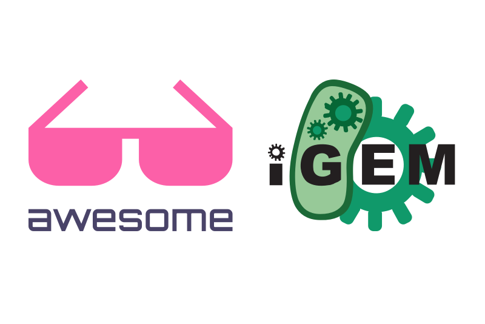

# Awesome iGEM

*A community curated list of awesome iGEM resources*

[What is awesome?](awesome.md)  

## Contents

- [iGEM Foundation](#igem-foundation)
- [iGEM Competition](#igem-competition)
- [Scientific Project](#scientic-project)
- [Human Practices](#human-practics)
- [Wiki](#wiki)
- [Presentation](#presentation)
- [Poster](#poster)
- [Public Engagement & Education](#public-engagement-&-education)
- [Entreprenuership](#entreprenuership)
- [Fundraising](#fundraising)
- [Team Management](#team-management)
- [Miscellaneous](#miscellaneous)

## iGEM Foundation

General information about iGEM

- [iGEM Website](http://igem.org/Main_Page) - An official website of the iGEM foundation. Also on [Facebook](https://www.facebook.com/iGEMFoundation/), [Twitter](https://twitter.com/iGEM), [LinkedIn](https://www.linkedin.com/company/igem-foundation/), [Instagram](https://www.instagram.com/igem_hq/), [Wikipedia](https://en.wikipedia.org/wiki/International_Genetically_Engineered_Machine).
- [After iGEM](https://after.igem.org) - An initiative to promote community of iGEM participants after iGEM competitions.

## iGEM Competition

iGEM Competition is held annually since 2004. The list below contains information for each specific year.

- [Competition information](http://igem.org/Competition)
- [LinkedIn page](https://www.linkedin.com/company/igem-competition/)

### Handbooks

- [Synthetic Biology Guidebook for iGEM High School](http://igem.org/wiki/images/7/71/AITF_iGEMHS_Guidebook_Final.pdf) by Alberta Innovates - Technology Futures and the iGEM community of Alberta, Canada 2014
- [The iGEM Team Handbook](http://2014.igem.org/wiki/images/c/c7/Virtus_Parva_Manual_TeamManual.pdf) by Virtus-Parva Mexico 2014
- [Running a successful iGEM team](http://2008.igem.org/wiki/images/3/3b/Running_a_successful_iGEM_Team_Final.pdf) by Alberta NINT 2008

### 2018

#### Official (Key information)

- [Homepage](http://2018.igem.org)
- [Calendar & Deadlines](http://2018.igem.org/Calendar)
- [Medal Criteria](http://2018.igem.org/Judging/Medals)
- [Judging Handbook](http://2018.igem.org/wiki/images/2/2f/2018_judging_handbook.pdf)

#### Team contributions & contents

- [Collaboration Page](http://2018.igem.org/Teams/Collaborations)
- [Meetups List](http://2018.igem.org/Teams/Meetups)
- [Slack Channel](http://xgem2018.slack.com)
- [European Meetup Posters](http://bit.ly/eu-posters) - A complete collection of poster photos from iGEM teams participating in European Meetup 2018 hosted by iGEM Munich

### Past iGEM Competition

- [Results](https://en.wikipedia.org/wiki/International_Genetically_Engineered_Machine#Competition_results)

## Scientific Research

- [BioBrickTM Registry](http://parts.igem.org/Main_Page)

## Human Practices

- [Handbook for Human Practices](http://2017.igem.org/wiki/images/0/0d/Stockholm_HP_Handbook.pdf) by Stockholm 2017

## Wiki

### 2018

- [Example page provided by iGEM HQ](http://2018.igem.org/Team:Example)
- [How to fix a bug on iGEM Wiki template: side menu on mobile displaying automatically on page load](https://medium.com/igem-copenhagen/how-to-fix-a-bug-igem-wikis-side-menu-on-mobile-displaying-automatically-on-page-load-8004c88e6615) by UCopenhagen 2018

### Best wiki winners

|Year|High School|Undergrad|Overgrad|
|--|--|--|--|
|2017|[TAS Taipei](http://2017.igem.org/Team:TAS_Taipei)|[Heidelberg](http://2017.igem.org/Team:Heidelberg)|[Wageningen UR](http://2017.igem.org/Team:Wageningen_UR)|
|2016|[UrbanTundra Edmonton](http://2016.igem.org/Team:UrbanTundra%20Edmonton)|[Imperial College](http://2016.igem.org/Team:Imperial_College)|[NTU-Singapore](http://2016.igem.org/Team:NTU-Singapore), [DSU-Denmark](http://2016.igem.org/Team:SDU-Denmark)|

### General

- [How to design an iGEM Wiki](http://2016.igem.org/Team:Peshawar/Wiki) by Peshawar 2016
- [How to customize an iGEM wiki](http://2011.igem.org/Team:DTU-Denmark/How_to_customize_an_iGEM_wiki) by DTU-Denmark 2011

### For developers

- [igem-wikiscraper](https://github.com/Virginia-iGEM/igem-wikiscraper) by Virginia 2018 - Python CLI for scraping data from iGEM wiki pages.
- [igem-wikibrick](https://github.com/Virginia-iGEM/igem-wikibrick) by Virginia 2018 - Virginia iGEM 2018's build tool for automating wiki creation.
- [generator-igemwiki](https://github.com/Virginia-iGEM/generator-igemwiki) by Virginia 2018, modified from Toronto 2016 - A Yeoman generator that creates templates for iGEM Wikis
- [igemwiki-api](https://github.com/igemuoftATG/igemwiki-api) by Toronto 2016 - NodeJS API and CLI for developing an iGEM wiki (downloading/uploading pages/stylesheets/scripts/templates/images)

## Presentation

## Poster

## Public Engagement & Education

## Entreprenuership

## Fundraising

## Team Management

## Miscellaneous

## Contribute

Contributions welcome! Read the [contribution guidelines](contributing.md) first.

### Contributors

|[UCopenhagen](https://www.igem.dk)|
|:-:|
||

## License

To the extent possible under law, iGEM Copenhagen has waived all copyright and
related or neighboring rights to this work.
